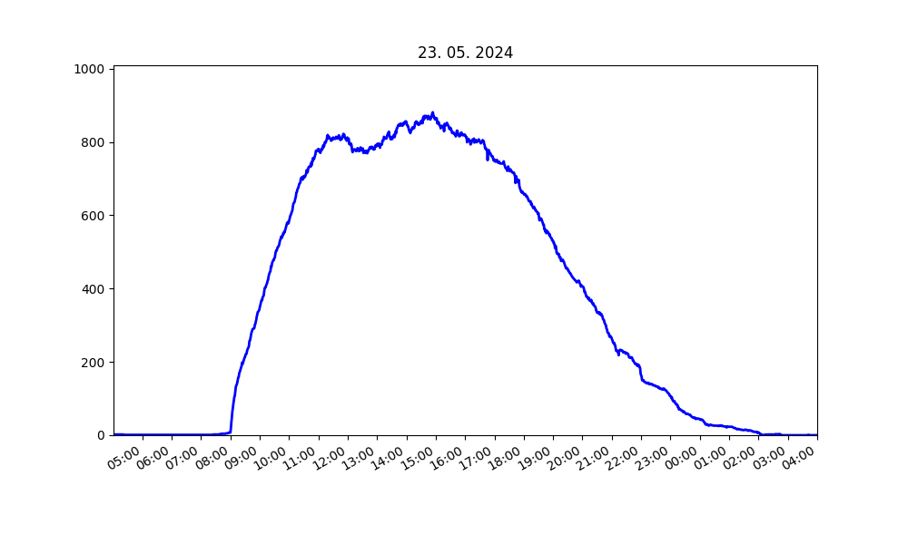
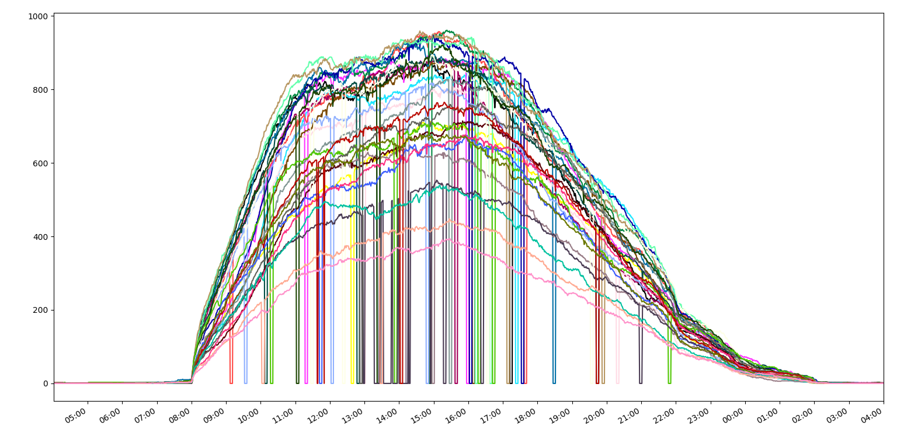
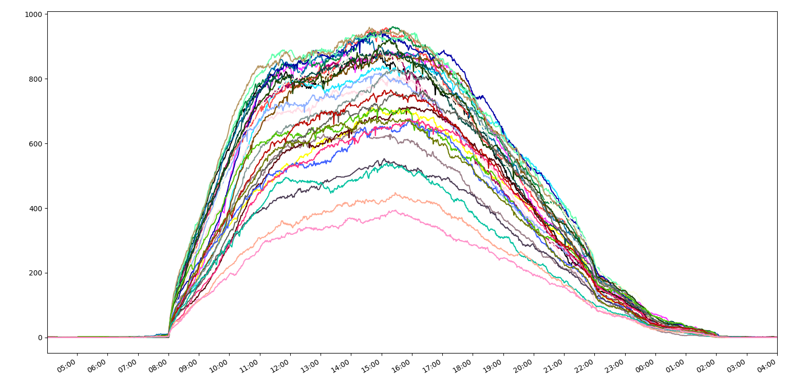

# NTK visualization

The National Library of Technology (NTK) has a counter on its website of how many people are inside at given time. The counter updates every minute, as of 22/5/2024 the data is available [here](https://ftp2.mvolfik.com/vojta_scraper/zaznam.txt) and is stored in a `time : value` format.

Using Python we can visualize collected data:

## Data cleaning

### Filling in missing data

Some data might be corrupted, values like `None`, `-1`, `Array` are not uncommon, sometimes the whole record is missing. If the number of records missing in one day is higher than user-defined threshold, that day is dropped from the data. Missing records are then replaced with an appropriate date and zero as a value. This gives us a list of lists of records with exactly 1440 records per day.

### Interpolation

From filling in missing data and all other factors, there might be some zeros surrounded by much bigger numbers. And, based on the thought that 800 people can't disappear from a library for five minutes and then return all at once, we can interpolate between the points at the start and at the end of the sublist containing only zeros and fill it in with interpolated data.

Before interpolation:

After interpolation:

